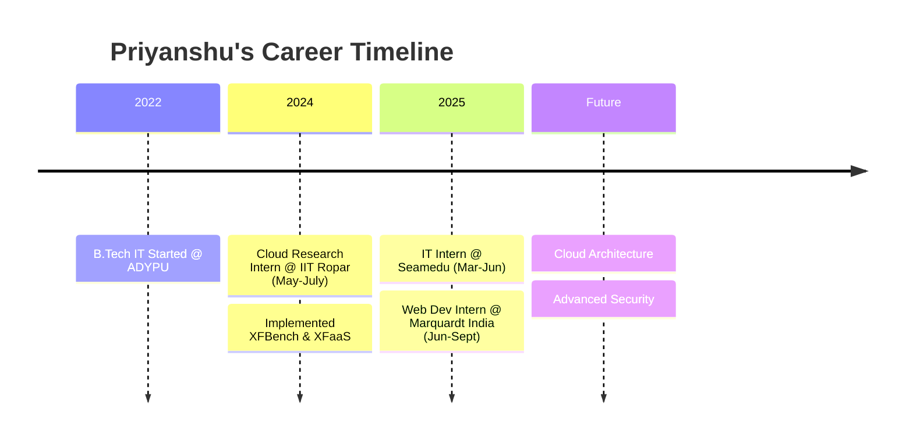

  
  # Portfolio | Priyanshu Kumar Sharma
  
  
  
  
  
  
  <h3>🚀 B.Tech IT Student | Cloud Technology & Information Security Specialist</h3>
  
  

    <b>I specialize in building secure cloud architectures, serverless computing solutions, and full-stack web applications.</b> 
    Ex-Research Intern at IIT Ropar | Open Source Contributor
  

  [🔗 Live Demo](https://priyanshuksharma.github.io/portfolio_priyanshuksharma/) | [📄 Resume](public/resume/resume.pdf) | [📫 Contact](#-lets-connect)

---

## 🚀 Featured Projects

  

    <table width="100%">
      <thead>
        <tr>
          <th width="220px" align="center" style="border-bottom: 1px solid #333333;">
            Project
          </th>
          <th width="250px" align="center" style="border-bottom: 1px solid #333333;">
            Tech
          </th>
          <th width="300px" align="center" style="border-bottom: 1px solid #333333;">
            Description
          </th>
        </tr>
      </thead>
      <tbody>
        <tr>
          <td align="center">
            
          </td>
          <td>Next.js, Tailwind, Prisma, Clerk</td>
          <td>AI-powered video management SaaS platform with automated business solutions.</td>
        </tr>
        <tr>
          <td align="center">
            
          </td>
          <td>AWS, IBM Quantum, Python, Docker</td>
          <td>Hybrid system integrating classical cloud with quantum processing for enhanced efficiency.</td>
        </tr>
        <tr>
          <td align="center">
            
          </td>
          <td>MERN Stack, OpenAI, Docker</td>
          <td>Bilingual educational management system with AI tutoring and real-time analytics.</td>
        </tr>
        <tr>
          <td align="center">
            
          </td>
          <td>Python, SHAP, LIME, Vertex AI</td>
          <td>Hands-on platform for model interpretability measuring Global and Local behavior.</td>
        </tr>
        <tr>
          <td align="center">
            
          </td>
          <td>Docker, Flask, Python</td>
          <td>Secure personal cloud storage system using containerization for scalability.</td>
        </tr>
        <tr>
          <td align="center">
            
          </td>
          <td>Flutter, Firebase</td>
          <td>Sustainable products marketplace app for iOS and Android.</td>
        </tr>
      </tbody>
    </table>
  

---

## 🧪 Certifications & Achievements

  

    <table width="90%" align="center" style="border: none;">
      <tr>
         <td width="48%" align="right" valign="middle">
          
        </td>
        <td width="52%" align="left" valign="middle">Creative Cloud Integration Award - Seamedu Awards 2025</td>
      </tr>
      <tr><td colspan="2" height="15"></td></tr>
      <tr>
        <td width="48%" align="right" valign="middle">
          
        </td>
        <td width="52%" align="left" valign="middle">Certified Fundamentals in Cybersecurity.</td>
      </tr>
      <tr><td colspan="2" height="15"></td></tr>
      <tr>
        <td width="48%" align="right" valign="middle">
          
        </td>
        <td width="52%" align="left" valign="middle">Certified Associate in Cybersecurity.</td>
      </tr>
      <tr><td colspan="2" height="15"></td></tr>
      <tr>
        <td width="48%" align="right" valign="middle">
          
        </td>
        <td width="52%" align="left" valign="middle">OCI 2025 Certified AI Foundations Associate.</td>
      </tr>
       <tr><td colspan="2" height="15"></td></tr>
      <tr>
        <td width="48%" align="right" valign="middle">
          
        </td>
        <td width="52%" align="left" valign="middle">Zero Trust Certified Associate.</td>
      </tr>
    </table>
  

---

## 📅 My Tech Journey

  

    <h3>Professional Timeline</h3>
    <table width="90%" align="center" style="border: none;">
      <tr>
        <td align="right" width="180px" valign="top"><b>June 2025 – Sept 2025 💼</b></td>
        <td><b>Web Development Intern @ Marquardt India</b> Full-stack development, UI/UX optimization, and feature implementation using MERN stack.</td>
      </tr>
      <tr><td colspan="2" height="10"></td></tr>
      <tr>
        <td align="right" width="180px" valign="top"><b>Mar 2025 – June 2025 🎓</b></td>
        <td><b>IT Intern @ Seamedu</b> Placement coordination, database management, and IT process automation.</td>
      </tr>
      <tr><td colspan="2" height="10"></td></tr>
      <tr>
        <td align="right" width="180px" valign="top"><b>May 2024 – July 2024 🔬</b></td>
        <td><b>Cloud Research Intern @ IIT Ropar</b> Serverless architecture research, XFBench implementation, and performance benchmarking.</td>
      </tr>
      <tr><td colspan="2" height="10"></td></tr>
      <tr>
        <td align="right" width="180px" valign="top"><b>Aug 2022 – Present 🏫</b></td>
        <td><b>B.Tech Information Technology @ ADYPU</b> Specializing in Cloud Tech & InfoSec. CGPA: 9.9.</td>
      </tr>
    </table>
  

---

## 📫 Let's Connect

  

    
I'm open to collaborations on Cloud, Security, and AI projects!

  

      
      
      
      
    

  

---

## ✨ Fun Facts

  

    <table width="90%" align="center">
      <tr>
        <td width="5%" align="right"></td>
        <td width="50%" align="left">I spend more time configuring IAM policies than I do sleeping.</td>
      </tr>
      <tr><td colspan="2" height="10"></td></tr>
      <tr>
        <td width="5%" align="right"></td>
        <td width="50%" align="left">Exploring the quantum realm (literally, with IBM Quantum).</td>
      </tr>
      <tr><td colspan="2" height="10"></td></tr>
      <tr>
        <td width="5%" align="right"></td>
        <td width="50%" align="left">Linux enthusiast - I probably have a script for that.</td>
      </tr>
    </table>
  

---

## 📊 GitHub Stats

  

  <!-- GitHub Streak Stats -->
  

  

  <!-- Compact Stats -->
  
  &nbsp;&nbsp;
  

  

  <!-- Activity Graph -->
  
  

---

  <!-- Snake Animation -->
  <picture>
    <source media="(prefers-color-scheme: dark)" srcset="https://raw.githubusercontent.com/PriyanshuKSharma/portfolio_priyanshuksharma/output/github-snake-dark.svg" />
    <source media="(prefers-color-scheme: light)" srcset="https://raw.githubusercontent.com/PriyanshuKSharma/portfolio_priyanshuksharma/output/github-snake.svg" />
    
  </picture>

  

    
  

