```mermaid
flowchart TD
    A[Technical Arsenal] --> B[Languages]
    A --> C[Web and App]
    A --> D[Cloud and Infrastructure]
    A --> E[Security and Systems]
    A --> F[Research]
    B --> B1[Java]
    B --> B2[Python]
    B --> B3[JavaScript]
    B --> B4[Dart]
    B --> B5[Bash]
    C --> C1[HTML5]
    C --> C2[CSS3]
    C --> C3[React]
    C --> C4[Django]
    C --> C5[Flutter]
    C --> C6[Tailwind CSS]
    D --> D1[AWS]
    D --> D2[Azure]
    D --> D3[GCP]
    D --> D4[Docker]
    D --> D5[Kubernetes]
    D --> D6[Terraform]
    D --> D7[Pulumi]
    E --> E1[IAM]
    E --> E2[Zero Trust]
    E --> E3[Network Security]
    E --> E4[Nmap]
    F --> F1[IBM Quantum]
    F --> F2[AWS Braket]
```

<div align="center">


<br/>

<picture>
  <source media="(prefers-color-scheme: dark)" srcset="https://readme-typing-svg.demolab.com?font=JetBrains+Mono&weight=700&size=20&duration=2800&pause=900&color=818CF8&center=true&vCenter=true&width=900&lines=%E2%9A%A1+Building+Nebula+%E2%80%94+API-first+Multi-Cloud+Command+Center;%F0%9F%94%90+Zero+Trust+%7C+IAM+%7C+Serverless+%7C+Quantum-Cloud;%F0%9F%8F%9B%EF%B8%8F+IIT+Ropar+Research+Fellow+%E2%80%94+IAS+2024;%F0%9F%93%84+IJCRT+%26+IJERT+Published+%7C+2+Active+Preprints;%F0%9F%8E%93+CGPA+9.9+%7C+B.Tech+IT+%E2%80%94+Cloud+%26+Information+Security">
  
</picture>

<br/><br/>

[](https://priyanshuksharma.github.io/portfolio_priyanshuksharma/)
[](https://www.linkedin.com/in/priyanshu-kumar-sharma-333800251/)
[](mailto:priyanshu17ks@gmail.com)
[](https://hub.docker.com/u/priyanshuksharma)
[](https://github.com/PriyanshuKSharma)

<br/>


[](https://github.com/PriyanshuKSharma)

</div>

---

```
┌─────────────────────────────────────────────────────────────────────────┐
│  priyanshu@cloudlab:~$ whoami                                           │
│                                                                         │
│  > Cloud Architect · Security Engineer · Researcher                     │
│  > B.Tech IT — Cloud Technology & Information Security · CGPA 9.9       │
│  > IIT Ropar Research Fellow · 2x Published · 2 Active Preprints        │
│  > Building systems that are secure, scalable, and research-backed      │
└─────────────────────────────────────────────────────────────────────────┘
```

---

## ⚡ What's Running Right Now

```text
🔵  Nebula          →  API-first multi-cloud command center (AWS + Azure + GCP)
                       FastAPI · Celery · Redis · Terraform · Docker · PostgreSQL

⚛️  Quantum-Cloud   →  Hybrid classical-quantum workflows for secure infra
                       AWS Braket · IBM Quantum · Docker · Python

🟡  XFBench/XFaaS   →  Serverless benchmarking across FaaS providers
                       AWS Lambda · OpenFaaS · Latency · Cold-starts

🟢  Research        →  IAM, Zero Trust, Multi-Agent AI, Distributed Security
```

---

## 📄 Research & Publications

<table>
<tr>
<td width="12%" align="center"><strong>ID</strong></td>
<td width="46%"><strong>Paper</strong></td>
<td width="20%"><strong>Venue</strong></td>
<td width="12%" align="center"><strong>Status</strong></td>
<td width="10%" align="center"><strong>Year</strong></td>
</tr>

<tr>
<td align="center"><code>PAPER-26-04</code></td>
<td><strong>Democratizing AWS Cloud Operations: A Unified Orchestration Approach To Standardized Infrastructure Management</strong><br/><sub>Introduces Nebula — async provisioning via Celery + Redis, unified AWS control plane</sub></td>
<td>IJCRT · Vol.14 Issue 4</td>
<td align="center">✅ Published</td>
<td align="center">Apr 2026</td>
</tr>

<tr>
<td align="center"><code>IJERTV15IS052093</code></td>
<td><strong>A Cloud-Native Multi-Agent Generative AI Framework for Demand Forecasting and Capacity Optimization using Vertex AI</strong><br/><sub>Multi-agent GenAI orchestration on Google Cloud for predictive capacity management</sub></td>
<td>IJERT · Vol.15 Issue 05</td>
<td align="center">✅ Published</td>
<td align="center">May 2026</td>
</tr>

<tr>
<td align="center"><code>QC-26-02</code></td>
<td><strong>Quantum Cloud Integration: A Practical Implementation and Analysis of Hybrid Quantum-Classical Computing Systems</strong><br/><sub>AWS Braket + classical cloud infra · quantum-classical data flow · latency analysis</sub></td>
<td>ADYPU Pune (Preprint)</td>
<td align="center">🔄 Ongoing</td>
<td align="center">Active</td>
</tr>

<tr>
<td align="center"><code>XAI-26-01</code></td>
<td><strong>A Comprehensive Framework for Explainable AI in Medical Diagnosis: Comparative Analysis of SHAP, LIME, Anchors, IG & Counterfactuals</strong><br/><sub>Five-method XAI evaluation · breast cancer diagnosis · GDPR/EU AI Act compliance</sub></td>
<td>ADYPU Pune (Preprint)</td>
<td align="center">🔄 Ongoing</td>
<td align="center">Active</td>
</tr>

<tr>
<td align="center"><code>IAS-2024</code></td>
<td><strong>XFBench & XFaaS: Serverless Benchmarking Research</strong><br/><sub>AWS Lambda · OpenFaaS · cold starts · latency · scalability benchmarks</sub></td>
<td>IIT Ropar · IAS Fellowship</td>
<td align="center">🏛️ Fellowship</td>
<td align="center">2024</td>
</tr>
</table>

---

## 🛠️ Flagship Projects

| # | Project | Stack | Link |
|---|---------|-------|------|
| 01 | **🌌 Nebula** — API-first multi-cloud orchestration. AWS + Azure + GCP unified behind one async control plane with cost observability and health monitoring | `FastAPI` `Celery` `Redis` `Terraform` `Docker` `PostgreSQL` `React` | [→ GitHub](https://github.com/PriyanshuKSharma/multi-cloud) |
| 02 | **⚛️ Quantum-Cloud Integration** — Hybrid architecture connecting classical cloud infra with IBM Quantum for secure experimental compute | `AWS` `IBM Quantum` `Docker` `Python` | [→ GitHub](https://github.com/PriyanshuKSharma/quantum-cloud-integration) |
| 03 | **🎬 Storage SaaS** — AI-powered video & business workflow SaaS with Clerk auth, Prisma ORM, Cloudinary media, Vercel deployment | `Next.js 14` `TypeScript` `Prisma` `Neon DB` `Cloudinary` | [→ GitHub](https://github.com/PriyanshuKSharma/media-storage-saas) |
| 04 | **📚 Rural Gyan** — Full-stack ed-tech platform with role-based dashboards, JWT auth, AI tutoring, bilingual (EN/HI), live classes | `React` `Node.js` `MongoDB` `Socket.io` `Docker` `OpenAI` | [→ GitHub](https://github.com/PriyanshuKSharma/rural-gyan-paltform) |
| 05 | **🧠 XAI Interpret** — Explainable AI platform with SHAP & LIME for interactive model interpretability on high-stakes ML decisions | `Python` `SHAP` `LIME` `Vertex AI` | [→ GitHub](https://github.com/PriyanshuKSharma/xai_explainaibility) |
| 06 | **🗄️ SkyVault** — Personal cloud storage with Dockerized deployment, secure file management, clean upload/download interface | `Docker` `Flask` `Python` `Bcrypt` | [→ GitHub](https://github.com/PriyanshuKSharma/SkyVault) · [Demo](https://priyanshuksharma.github.io/SkyVault/) |
| 07 | **🛒 Ecobizz** — Cross-platform Flutter app for sustainable e-commerce (GDSC Solution Challenge 2024) | `Flutter` `Dart` | [→ GitHub](https://github.com/PriyanshuKSharma/EcoBizz-Sustainably-Yours---GDSC-Solution-Challenge-2024) |

---

## 🖼️ Repository Showcase

<p align="center">

| 🌌 Nebula — Multi-Cloud Orchestration | ⚛️ Quantum-Cloud Integration |
|---|---|
| [](https://github.com/PriyanshuKSharma/multi-cloud) | [](https://github.com/PriyanshuKSharma/quantum-cloud-integration) |
| API-first multi-cloud command center | Hybrid classical-quantum compute |

| 📚 Rural Gyan Platform | 🧠 XAI Interpret |
|---|---|
| [](https://github.com/PriyanshuKSharma/rural-gyan-paltform) | [](https://github.com/PriyanshuKSharma/xai_explainaibility) |
| Full-stack ed-tech, AI tutoring, bilingual | Explainable AI for medical diagnosis |

</p>

---


**Languages**

<table align="center">
  <tr>
    <td></td>
    <td></td>
    <td></td>
    <td></td>
    <td></td>
  </tr>
  <tr>
    <td colspan="5" align="center"><sub>Java • Python • JavaScript • Dart • Bash</sub></td>
  </tr>
</table>

**Web and App Development**

<table align="center">
  <tr>
    <td></td>
    <td></td>
    <td></td>
    <td></td>
    <td></td>
    <td></td>
  </tr>
  <tr>
    <td colspan="6" align="center"><sub>HTML5 • CSS3 • React • Django • Flutter • Tailwind CSS</sub></td>
  </tr>
</table>

**Cloud, Serverless, and Infrastructure**

<table align="center">
  <tr>
    <td></td>
    <td></td>
    <td></td>
    <td></td>
    <td></td>
    <td></td>
    <td></td>
    <td></td>
  </tr>
  <tr>
    <td colspan="8" align="center"><sub>AWS • Azure • GCP • AWS Lambda • OpenFaaS • Cloudflare • Terraform • Pulumi</sub></td>
  </tr>
</table>

**Security and Systems**

<table align="center">
  <tr>
    <td></td>
    <td></td>
    <td></td>
    <td></td>
    <td></td>
    <td></td>
    <td></td>
  </tr>
  <tr>
    <td colspan="7" align="center"><sub>IAM • Zero Trust • Network Security • Linux • Docker • Kubernetes • Nmap</sub></td>
  </tr>
</table>

**Data, DevOps, and Storage**

<table align="center">
  <tr>
    <td></td>
    <td></td>
    <td></td>
    <td></td>
    <td></td>
    <td></td>
  </tr>
  <tr>
    <td colspan="6" align="center"><sub>Redis • MySQL • Amazon S3 • GitHub • GitLab • Neon</sub></td>
  </tr>
</table>

**Exploring Next**

<table align="center">
  <tr>
    <td></td>
    <td></td>
  </tr>
  <tr>
    <td colspan="2" align="center"><sub>IBM Quantum • AWS Braket</sub></td>
  </tr>
</table>



---


## 🏅 Certifications

| Credential | Issuer | Type |
|-----------|--------|------|
| **Fortinet Certified Fundamentals in Cybersecurity** | Fortinet | Vendor Cert |
| **Fortinet Certified Associate in Cybersecurity** | Fortinet | Vendor Cert |
| **Fundamentals of Cybersecurity (EDU-102)** | Zscaler | Security Cert |
| **Zero Trust Certified Associate (ZTCA)** | Zscaler | Vendor Cert |
| **Oracle Cloud Infrastructure 2025 AI Foundations Associate** | Oracle University | Cloud & AI Cert |
| **AWS Services for Solutions Architect Associate** | Udemy | Course Cert |
| **SQL (Basic)** | HackerRank | Skill Cert |
| **Zscaler Zero Trust Cloud Security Virtual Internship** | EduSkills | Internship Cert |
| **Fortinet Network Security Virtual Internship** | AICTE EduSkills | Internship Cert |

---

## 💼 Experience

```
 ──────────────────────────────────────────────────────────────────
  Jun–Sep 2025   Web Dev Intern          Marquardt India Pvt. Ltd.
                 Full-stack • HTML5/CSS3 • JS • EJS • MySQL • Express

  Mar–Jun 2025   IT Intern               Seamedu, Pune
                 Placement Coordination • IT Operations • Documentation

  May–Jul 2024 ⭐ Cloud Research Intern   IIT Ropar  [IAS Fellowship]
                 XFBench • XFaaS • Serverless benchmarking • FaaS research

  Apr–Jun 2024   Zero Trust Intern        Zscaler via EduSkills
                 Zero Trust architecture • cloud security analysis

  Jul–Sep 2024   Network Security Intern  Fortinet via EduSkills
                 Threat analysis • network defense • cyber frameworks

  Jul–Aug 2024   Project Intern           OctaNet Services Pvt. Ltd.
                 Frontend web development • project delivery

  Apr–May 2023   Project Intern           InternPe
                 Web development • project delivery

  Nov–Dec 2022   Student Intern           Mindler
                 Communication • early professional exposure
 ──────────────────────────────────────────────────────────────────
```

---

## 🎓 Education

```
 ──────────────────────────────────────────────────────────────────
  2022–2026  B.Tech — Information Technology
             Ajeenkya D Y Patil University, Pune
             Specialization: Cloud Technology & Information Security
             CGPA: 9.9 / 10  ★ Active in hackathons & security clubs

  2020–2022  Intermediate — Science & Mathematics
             Sri Chaitanya Jr. Kalasala, Hyderabad  ·  93.9%

  2019–2020  Higher Secondary
             Sri Chaitanya High School, Hyderabad   ·  87.6%
 ──────────────────────────────────────────────────────────────────
```

---

## 🏆 Awards & Hackathons

<table>
<tr><td width="50%" valign="top">

**Awards**

| Year | Award |
|------|-------|
| 2026 | ☁️ Multi Cloud Excellence Award · Seamedu |
| 2025 | 🎨 Creative Cloud Integration Award · Seamedu |
| 2025 | 🥉 Bronze Medal · IBM ICE Day Ideathon |
| 2019 | 🥉 School Rank 3rd · SOF IMO |

</td><td width="50%" valign="top">

**9 Hackathon Sprints**

```
HACK-01  ADYPU Problem-A-Thon              2022
HACK-02  Sharda University Tech-a-thon     2022
HACK-03  Smart India Hackathon (Internal)  2023
HACK-04  NASA Space App Challenge          2023
HACK-05  UNESCO-MIL                        2023
HACK-06  Google Solution Challenge         2024
HACK-07  Hackron — Newton School × ADYPU   2025
HACK-08  Smart India Hackathon (External)  2025
HACK-09  IBM ICE Day Ideathon              2025
```

</td></tr>
</table>

---

## 📊 GitHub Stats

<p align="center">
  
</p>

<p align="center">
  
</p>

<p align="center">
  
</p>

---

## 🤝 Open Source & Community

- Contributed to **[Interns-MQI-25](https://github.com/Interns-MQI-25)** collaborative internship project at Marquardt India
- Work across Docker, Cloud, and DevOps collaborative environments
- Repositories are designed to be learner-friendly with clean docs and reproducible setups

<p align="center">
  <a href="https://github.com/Interns-MQI-25/project-interns">
    
  </a>
</p>

---

## 🎯 What's Next

```
→  Mature Nebula into a production-grade multi-cloud orchestration platform
→  Deepen IAM, Zero Trust, and multi-cloud security architecture research
→  Publish ongoing preprints — Quantum Cloud & XAI Medical Diagnosis
→  Contribute to open-source cloud and security tooling
→  Build platforms that are elegant, secure, and genuinely useful
```

---

## 🚀 Run the Portfolio Locally

```bash
git clone https://github.com/PriyanshuKSharma/portfolio_priyanshuksharma.git
cd portfolio_priyanshuksharma
npm install && npm start
# → http://localhost:3000
```

---

## 📡 Connect

<p align="center">
  <a href="mailto:priyanshu17ks@gmail.com"></a>&nbsp;
  <a href="https://www.linkedin.com/in/priyanshu-kumar-sharma-333800251/"></a>&nbsp;
  <a href="https://github.com/PriyanshuKSharma"></a>&nbsp;
  <a href="https://hub.docker.com/u/priyanshuksharma"></a>&nbsp;
  <a href="https://priyanshuksharma.github.io/portfolio_priyanshuksharma/"></a>
</p>

<div align="center">

<br/>

> *Cloud architecture, security thinking, and research-backed building —*
> *for systems meant to be used, not just described.*

<br/>


</div>
