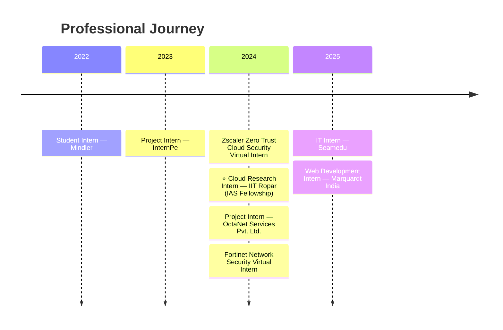
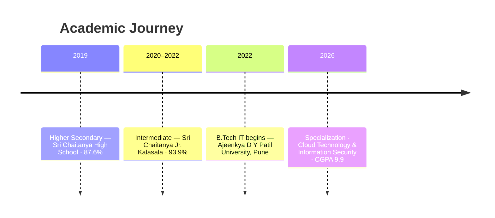
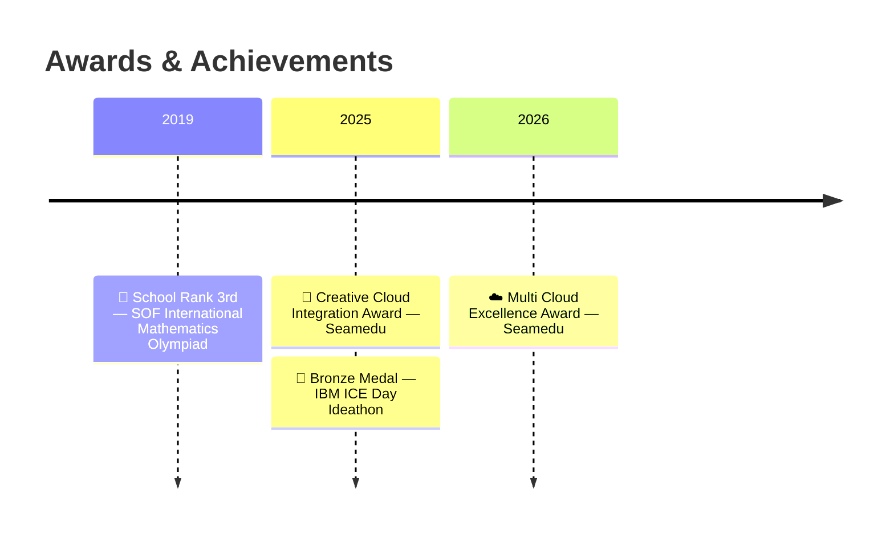

<div align="center">


<picture>
  <source media="(prefers-color-scheme: dark)" srcset="https://readme-typing-svg.demolab.com?font=Fira+Code&weight=700&size=22&duration=2500&pause=800&color=22D3EE&center=true&vCenter=true&width=860&lines=%F0%9F%8E%93+B.Tech+IT+%E2%80%94+Cloud+Technology+%26+Information+Security;%E2%98%81%EF%B8%8F+Building+Nebula+%E2%80%94+API-first+Multi-Cloud+Command+Center;%F0%9F%94%92+Zero+Trust+%7C+IAM+%7C+Serverless+%7C+Quantum-Cloud;%F0%9F%8F%9B%EF%B8%8F+IIT+Ropar+Research+Fellow+%E2%80%94+IAS+2024;%E2%9A%99%EF%B8%8F+CGPA+9.9+%7C+IJCRT+Published+%7C+Seamedu+Award+Winner">
  
</picture>

<br/>

[](https://priyanshuksharma.github.io/portfolio_priyanshuksharma/)
[](https://www.linkedin.com/in/priyanshu-kumar-sharma-333800251/)
[](mailto:priyanshu17ks@gmail.com)
[](https://hub.docker.com/u/priyanshuksharma)

<br/>

[](https://github.com/PriyanshuKSharma)
[](https://github.com/PriyanshuKSharma)


<br/>

> *Cloud architecture, security thinking, and research-backed building —*
> *for systems that are meant to be used, not just described.*

</div>

---

## 📋 Table of Contents

<details open>
<summary><strong>Navigate</strong></summary>

- [⚡ Mission Control](#-mission-control)
- [🚀 What I'm Building Now](#-what-im-building-now)
- [📄 Research & Publications](#-research--publications)
- [🛠️ Flagship Projects](#️-flagship-projects)
- [🖼️ Repository Showcase](#️-repository-showcase)
- [🧰 Technical Arsenal](#-technical-arsenal)
- [🏅 Certifications](#-certifications)
- [💼 Experience](#-experience)
- [🎓 Education](#-education)
- [🏆 Awards & Recognition](#-awards--recognition)
- [📊 GitHub Stats](#-github-stats)
- [🤝 Open Source & Community](#-open-source--community)
- [🎯 Aiming For](#-aiming-for)
- [📡 Connect](#-connect)

</details>

---

## ⚡ Mission Control

<table>
<tr>
<td width="50%" valign="top">

### 🔨 Builder Mode

I like projects where **architecture, security, and experimentation** all matter at once.

- Turning ideas into working systems, not just concept notes
- Treating security as a design choice, not a late add-on
- Shipping reproducible setups, docs, and developer-friendly workflows
- Building products with a strong architecture story behind them

</td>
<td width="50%" valign="top">

### 🔬 Research Mode

The problems that keep me curious sit right at the edge of infrastructure.

- Multi-cloud orchestration and unified control planes
- Serverless benchmarking and cloud performance analysis
- IAM, AAA, Zero Trust, and distributed access models
- Hybrid quantum-cloud systems and future-facing infrastructure

</td>
</tr>
</table>

---

## 🚀 What I'm Building Now

```text
🔵  Nebula         →  API-first multi-cloud command center (AWS + Azure + GCP)
🟡  XFBench/XFaaS  →  Serverless benchmarking across FaaS providers
🟣  Quantum-Cloud  →  Hybrid classical-quantum workflows for secure infra
🟢  Research        →  IAM, Zero Trust, and distributed security models
```

---

## 📄 Research & Publications

### 🗞️ Published — IJCRT 2026

> **"Democratizing AWS Cloud Operations: A Unified Orchestration Approach To Standardized Infrastructure Management"**

| | |
|--|--|
| **Venue** | International Journal of Creative Research Thoughts (IJCRT), Vol. 14, Issue 4, April 2026 |
| **DOI** | [10.56975/ijcrt.v14i4.305033](https://doi.org/10.56975/ijcrt.v14i4.305033) |
| **Core Contribution** | A framework decoupling user-facing cloud workflows from long-running provisioning tasks via async execution (Celery + Redis) |

### 🏛️ IIT Ropar — Cloud Research Internship (IAS Fellowship 2024)

Through the **Indian Academy of Sciences Summer Research Fellowship Program**, focused on serverless flexibility and performance.

| | |
|--|--|
| **Project** | XFBench & XFaaS Development |
| **Focus** | Benchmarking serverless workloads across FaaS providers (AWS Lambda, OpenFaaS) — latency, scalability, cold starts |
| **Repos** | [XFBench](https://github.com/PriyanshuKSharma/serverless-faas-workbench_IIT_Rpr) · [XFaaS](https://github.com/PriyanshuKSharma/XFaaS-IIT_Rpr) |

### ⚛️ Hybrid Quantum-Cloud Systems

Exploring the intersection of classical cloud storage and quantum computing for secure, scalable experimentation.

- **Tools:** IBM Quantum Experience · AWS Braket · Docker
- **Repo:** [quantum-cloud-integration](https://github.com/PriyanshuKSharma/quantum-cloud-integration)

---

## 🛠️ Flagship Projects

| Project | What It Does | Stack | Link |
|---------|-------------|-------|------|
| **🌌 Nebula** | API-first multi-cloud orchestration platform unifying AWS, Azure & GCP behind a single control plane with async provisioning, cost observability, and health monitoring | FastAPI · Celery · Redis · Terraform · Docker | [GitHub](https://github.com/PriyanshuKSharma/multi-cloud) |
| **⚛️ Quantum-Cloud Integration** | Hybrid classical-quantum architecture connecting cloud infrastructure with IBM Quantum for secure, experimental compute workflows | AWS · IBM Quantum · Docker · Python | [GitHub](https://github.com/PriyanshuKSharma/quantum-cloud-integration) |
| **🗄️ SkyVault** | Personal cloud storage with Dockerized deployment, secure file management, and a clean upload/download interface | Docker · Node.js · Express | [GitHub](https://github.com/PriyanshuKSharma/SkyVault) · [Demo](https://priyanshuksharma.github.io/SkyVault/) |
| **🧠 XAI Interpret** | Explainable AI platform using SHAP & LIME for interactive model interpretability and visual insights on high-stakes ML decisions | Python · SHAP · LIME · Cloud-ready | [GitHub](https://github.com/PriyanshuKSharma/xai_explainaibility) |
| **📚 Rural Gyan** | Full-stack educational platform with role-based dashboards, bilingual support, AI-assisted features, and JWT auth | React · Node.js · Docker · JWT | [GitHub](https://github.com/PriyanshuKSharma/rural-gyan-paltform) |
| **🎬 Storage SaaS** | AI-powered video & business workflow SaaS with Clerk auth, Prisma ORM, Cloudinary media, and Vercel deployment | Next.js 14 · Tailwind · Prisma · Neon DB | [GitHub](https://github.com/PriyanshuKSharma/media-storage-saas) |
| **🛒 Ecobizz** | Cross-platform Flutter app for sustainable e-commerce (GDSC Solution Challenge 2024) | Flutter · Dart | [GitHub](https://github.com/PriyanshuKSharma/EcoBizz-Sustainably-Yours---GDSC-Solution-Challenge-2024) |

---

## 🖼️ Repository Showcase

<p align="center">
  <a href="https://github.com/PriyanshuKSharma/multi-cloud">
    
  </a>
  <a href="https://github.com/PriyanshuKSharma/quantum-cloud-integration">
    
  </a>
</p>
<p align="center">
  <a href="https://github.com/PriyanshuKSharma/rural-gyan-paltform">
    
  </a>
  <a href="https://github.com/PriyanshuKSharma/xai_explainaibility">
    
  </a>
</p>

---

## 🧰 Technical Arsenal

### Languages

<p align="center">
  &nbsp;&nbsp;
  &nbsp;&nbsp;
  &nbsp;&nbsp;
  &nbsp;&nbsp;
  
</p>
<p align="center"><sub><strong>Java &nbsp;•&nbsp; Python &nbsp;•&nbsp; JavaScript &nbsp;•&nbsp; Dart &nbsp;•&nbsp; Bash</strong></sub></p>

### ☁️ Cloud, Serverless & IaC

<p align="center">
  &nbsp;&nbsp;
  &nbsp;&nbsp;
  &nbsp;&nbsp;
  &nbsp;&nbsp;
  &nbsp;&nbsp;
  
</p>
<p align="center"><sub><strong>AWS &nbsp;•&nbsp; Azure &nbsp;•&nbsp; GCP &nbsp;•&nbsp; Terraform &nbsp;•&nbsp; Pulumi &nbsp;•&nbsp; Cloudflare</strong></sub></p>

### 🔒 Security & Systems

<p align="center">
  &nbsp;&nbsp;
  &nbsp;&nbsp;
  &nbsp;&nbsp;
  &nbsp;&nbsp;
  &nbsp;&nbsp;
  
</p>
<p align="center"><sub><strong>IAM &nbsp;•&nbsp; Zero Trust &nbsp;•&nbsp; Network Security &nbsp;•&nbsp; Linux &nbsp;•&nbsp; Docker &nbsp;•&nbsp; Kubernetes</strong></sub></p>

### 🌐 Web & App

<p align="center">
  &nbsp;&nbsp;
  &nbsp;&nbsp;
  &nbsp;&nbsp;
  &nbsp;&nbsp;
  &nbsp;&nbsp;
  
</p>
<p align="center"><sub><strong>React &nbsp;•&nbsp; Django &nbsp;•&nbsp; Flutter &nbsp;•&nbsp; Tailwind CSS &nbsp;•&nbsp; HTML5 &nbsp;•&nbsp; CSS3</strong></sub></p>

### 🗄️ Data, DevOps & Storage

<p align="center">
  &nbsp;&nbsp;
  &nbsp;&nbsp;
  &nbsp;&nbsp;
  &nbsp;&nbsp;
  
</p>
<p align="center"><sub><strong>Redis &nbsp;•&nbsp; MySQL &nbsp;•&nbsp; Amazon S3 &nbsp;•&nbsp; GitHub &nbsp;•&nbsp; GitLab &nbsp;•&nbsp; Neon DB</strong></sub></p>

### ⚛️ Exploring Next

<p align="center">
  &nbsp;&nbsp;&nbsp;
  
</p>
<p align="center"><sub><strong>IBM Quantum &nbsp;•&nbsp; AWS Braket</strong></sub></p>

---

## 🏅 Certifications

<details open>
<summary><strong>View credentials</strong></summary>

| Credential | Provider | Type |
|-----------|----------|------|
| **Fortinet Certified Fundamentals in Cybersecurity** | Fortinet | Vendor Certification |
| **Fortinet Certified Associate in Cybersecurity** | Fortinet | Vendor Certification |
| **Fundamentals of Cybersecurity (EDU-102)** | Zscaler | Security Credential |
| **Zero Trust Certified Associate (ZTCA)** | Zscaler | Vendor Certification |
| **Oracle Cloud Infrastructure 2025 AI Foundations Associate** | Oracle University | Cloud & AI Certification |
| **AWS Services for Solutions Architect Associate** | Udemy | Course Certificate |
| **SQL (Basic)** | HackerRank | Skill Credential |
| **Python Mastery for Beginners** | Udemy | Course Certificate |
| **Zscaler Zero Trust Cloud Security Virtual Internship** | EduSkills | Virtual Internship |
| **Fortinet Network Security Virtual Internship** | AICTE EduSkills | Virtual Internship |

</details>

---

## 💼 Experience



| Period | Role | Organization | Focus |
|--------|------|-------------|-------|
| **Jun–Sep 2025** | Web Development Intern | Marquardt India | Full-stack development, UI/UX, feature delivery |
| **Mar–Jun 2025** | IT Intern | Seamedu | Operations, coordination, documentation |
| **Jul–Sep 2024** | Fortinet Network Security Virtual Intern | EduSkills | Cyber threat analysis, network defense |
| **Jul–Aug 2024** | Project Intern | OctaNet Services Pvt. Ltd. | Frontend web development |
| **May–Jul 2024** | ⭐ Cloud Research Intern | **IIT Ropar** | Serverless benchmarking, infrastructure research |
| **Apr–Jun 2024** | Zscaler Zero Trust Virtual Intern | EduSkills | Zero Trust architecture, cloud security |
| **Apr–May 2023** | Project Intern | InternPe | Web development, project delivery |
| **Nov–Dec 2022** | Student Intern | Mindler | Communication, early professional exposure |

---

## 🎓 Education



| Degree | Institution | Period | Highlight |
|--------|------------|--------|-----------|
| **B.Tech — Information Technology** | Ajeenkya D Y Patil University, Pune | Aug 2022 – Jun 2026 | Cloud Technology & Information Security · **CGPA: 9.9** |
| **Intermediate (11th & 12th)** | Sri Chaitanya Jr. Kalasala, Hyderabad | Apr 2020 – May 2022 | Science & Mathematics · **93.9%** |
| **Higher Secondary (10th)** | Sri Chaitanya High School, Hyderabad | Apr 2019 – May 2020 | **87.6%** |

---

## 🏆 Awards & Recognition



| Award | Event | Year |
|-------|-------|------|
| ☁️ **Multi Cloud Excellence Award** | Seamedu Awards | 2026 |
| 🎨 **Creative Cloud Integration Award** | Seamedu Awards | 2025 |
| 🥉 **Bronze Medal** | IBM Innovation Centre for Education (ICE) Day Ideathon | 2025 |
| 🥉 **School Rank: 3rd** | SOF International Mathematics Olympiad | 2019 |

---

## 📊 GitHub Stats

<p align="center">
  
</p>

<p align="center">
  
  
</p>

<p align="center">
  
</p>

---

## 🤝 Open Source & Community

- Contributed to **[Interns-MQI-25](https://github.com/Interns-MQI-25)** and its collaborative [project-interns](https://github.com/Interns-MQI-25/project-interns) repository
- Work in Docker, Cloud, and DevOps collaborative environments
- Enjoy sharing through well-documented, learner-friendly repositories

<p align="center">
  <a href="https://github.com/Interns-MQI-25/project-interns">
    
  </a>
</p>

---

## 🎯 Aiming For

```text
→  Build Nebula into a serious, production-grade multi-cloud orchestration platform
→  Deepen research on IAM, Zero Trust, and multi-cloud security architectures
→  Contribute to open-source security and cloud tooling
→  Design platforms that are secure, elegant, and genuinely useful
→  Publish more research-backed engineering work
```

---

## ⚡ Fun Facts

| Signal | What It Means |
|--------|--------------|
| `terminal open + architecture sketch nearby` | Turning a research idea into a working system |
| `IAM policy on screen` | Puzzle-solving mode — won't stop until the access model makes sense |
| `benchmark notes everywhere` | Curiosity → experimentation → engineering |
| `IBM Quantum + cloud docs both open` | Exploring how classical and quantum infrastructure can connect |
| `a repetitive task annoys me twice` | It's one script away from being automated |
| `new repo appears suddenly` | A side idea just got promoted to prototype |

---

## 🚀 Run the Portfolio Locally

```bash
git clone https://github.com/PriyanshuKSharma/portfolio_priyanshuksharma.git
cd portfolio_priyanshuksharma
npm install
npm start
# → http://localhost:3000
```

---

## 📡 Connect

<p align="center">
  <a href="mailto:priyanshu17ks@gmail.com"></a>&nbsp;
  <a href="https://www.linkedin.com/in/priyanshu-kumar-sharma-333800251/"></a>&nbsp;
  <a href="https://github.com/PriyanshuKSharma"></a>&nbsp;
  <a href="https://hub.docker.com/u/priyanshuksharma"></a>&nbsp;
  <a href="https://priyanshuksharma.github.io/portfolio_priyanshuksharma/"></a>
</p>

<div align="center">

<br/>

*Thanks for stopping by.*
*If you're building in cloud, security, research, or modern infrastructure — I'd be glad to connect and collaborate.*


</div>
